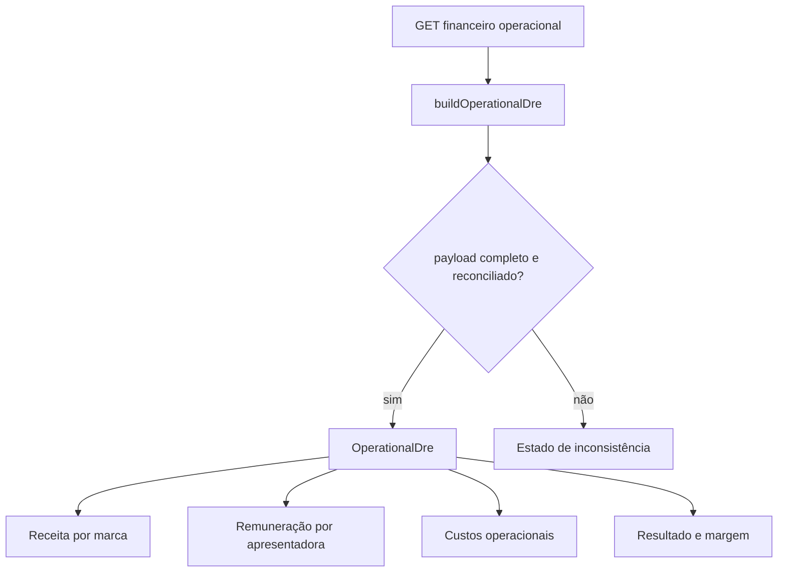

# Financeiro com DRE confiável - Design

**Spec**: `.specs/features/financeiro-dre-confiavel/spec.md`
**Status**: Approved

---

## Architecture Overview

O frontend normalizará o payload já existente de `/v1/financeiro/operacional` em uma estrutura de apresentação reconciliada. Um componente dedicado renderizará o resumo e as seções expansíveis. `FinanceiroPage` continuará responsável por período, queries, permissões e CRUD de custos.



### Approaches considered

| Approach | Trade-off | Decision |
| --- | --- | --- |
| Normalizar o payload operacional no frontend | Menor mudança; mantém o backend e usa memória já disponível, inclusive valores comparados | Chosen |
| Adicionar um novo objeto `dre` ao endpoint | Centraliza a apresentação, mas duplica o contrato e amplia o risco sem necessidade | Rejected |
| Transformar `/financeiro/resumo` no DRE | Afeta consumidores legados e mistura fontes de cálculo diferentes | Rejected |

O usuário aprovou a fonte operacional e pediu aplicação imediata. A abordagem escolhida entrega o escopo sem mudar regras ou contratos.

## Code Reuse Analysis

### Existing Components to Leverage

| Component | Location | How to Use |
| --- | --- | --- |
| `MetricCard` | `src/components/ui/MetricCard.tsx` | Resumo de receita, despesas, resultado e margem. |
| `Card` | `src/components/ui/Card.tsx` | Superfície principal do DRE. |
| `Badge` | `src/components/ui/Badge.tsx` | Critério de cobrança e categorias. |
| `EmptyState` | `src/components/ui/States.tsx` | Ausência de lançamentos ou payload inconsistente. |
| Formatters | `src/utils/format.ts` | Dinheiro, percentuais, datas e coerção segura. |
| Payload operacional | `src/routes/financeiro.js:453` no backend | Fonte única dos lançamentos e totais. |

### Integration Points

| System | Integration Method |
| --- | --- |
| Financeiro API | `getFinanceiroOperacional(fp)` já usado por `FinanceiroPage`. |
| Custos | CRUD e invalidações atuais permanecem. |
| PDFs/CSVs | Nenhum contrato ou campo será alterado. |
| Permissões | `canWrite(user)` continua controlando mutações. |

## Components

### Operational DRE normalizer

- **Purpose**: Validar, agrupar e reconciliar o payload operacional sem inventar valores ausentes.
- **Location**: `src/components/financeiro/operational-dre.ts`
- **Interfaces**:
  - `buildOperationalDre(data: JsonRecord): OperationalDre | null`
  - `moneyEquals(left: number, right: number): boolean`
- **Dependencies**: `asArray`, `asNumber`, `asString`, `getRecord`.
- **Reuses**: Categorias e memória emitidas pelo endpoint atual.

### OperationalDre

- **Purpose**: Renderizar o resultado principal e as três seções expansíveis.
- **Location**: `src/components/financeiro/OperationalDre.tsx`
- **Interfaces**:
  - `OperationalDre({ data }: { data: JsonRecord }): JSX.Element`
- **Dependencies**: normalizer, componentes UI e tokens CSS existentes.
- **Reuses**: `MetricCard`, `Card`, `Badge`, `EmptyState` e formatadores.

### FinanceiroPage integration

- **Purpose**: Tornar o DRE a visão principal e remover consultas e blocos de margem parcial.
- **Location**: `src/pages/FinanceiroPage.tsx`
- **Interfaces**: contrato público da página permanece inalterado.
- **Dependencies**: `OperationalDre` e query operacional existente.
- **Reuses**: período, permissões, custos, abas e detalhes existentes.

## Data Models

```typescript
interface OperationalDre {
  receita: {
    total: number
    marcas: Array<{
      id: string
      nome: string
      tipoCobranca: 'fixo_mais_comissao' | 'fixo_ou_comissao'
      fixoCalculado: number
      comissaoCalculada: number
      receitaReconhecida: number
      criterio: string
      gmv: number
      lives: number
    }>
  }
  apresentadoras: {
    total: number
    fixo: number
    comissao: number
    adicionais: number
    pessoas: Array<{
      id: string
      nome: string
      fixo: number
      comissao: number
      adicionais: number
      total: number
    }>
  }
  custos: {
    total: number
    grupos: Array<{
      tipo: string
      total: number
      itens: Array<{ id: string; descricao: string; valor: number }>
    }>
  }
  totalDespesas: number
  resultado: number
  margemPct: number | null
}
```

**Relationships**: os subtotais são derivados das linhas existentes. A soma `apresentadoras.total + custos.total` deve igualar `despesas_fixas + despesas_variaveis`; `receita.total - totalDespesas` deve igualar `resultado`.

## Error Handling Strategy

| Error Scenario | Handling | User Impact |
| --- | --- | --- |
| Totais ou arrays ausentes | Normalizer retorna `null` | Estado “Detalhamento operacional indisponível”. |
| Soma detalhada diverge dos totais | Normalizer retorna `null` | Nenhum número parcial é apresentado como verdade. |
| Receita zero | Margem percentual fica `null` | Exibe “—”, sem divisão inventada. |
| Query falha | Fluxo existente de `ErrorState` | Usuário pode tentar novamente. |

## Risks & Concerns

| Concern | Location | Impact | Mitigation |
| --- | --- | --- | --- |
| Duas margens incompatíveis | `src/pages/FinanceiroPage.tsx:426` | Decisão com custo incompleto | Remover a margem parcial e destacar apenas o DRE. |
| Payload operacional é `JsonRecord` sem tipo estático | `src/pages/FinanceiroPage.tsx:226` | Campo ausente pode virar zero | Normalizer exige arrays e totais reportados antes de renderizar. |
| `fixo_ou_comissao` retorna só a linha vencedora | `src/routes/financeiro.js:580` | Detalhe pode esconder valor comparado | Reconstruir o perdedor pelos campos `fixo_comparado` ou `comissao_comparada` da memória. |
| Comissão plana ainda aparece como base | `src/components/configuracoes/UsuariosList.tsx:194` | Regra obsoleta parece vigente | Remover somente esse rótulo visual; manter campo técnico por compatibilidade. |
| PDFs dependem de snapshots e memória completa | `src/components/financeiro/PresenterSettlement.tsx:66` | Limpeza ampla quebraria documentos | Não alterar tipos, endpoints ou campos usados por relatórios. |

## Tech Decisions

| Decision | Choice | Rationale |
| --- | --- | --- |
| Camada de agrupamento | Função pura no frontend | Permite reconciliação e testes sem mudar API. |
| Arredondamento | Comparar centavos inteiros | Evita falso erro por ponto flutuante. |
| Interação | `<details>` sem estado global | Acessível, nativo e consistente com a tela atual. |
| Visual | Tokens CSS e componentes existentes | Preserva tema claro/escuro e reduz risco. |
